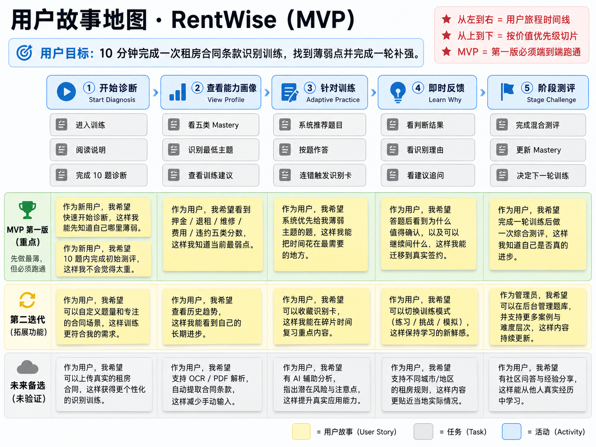
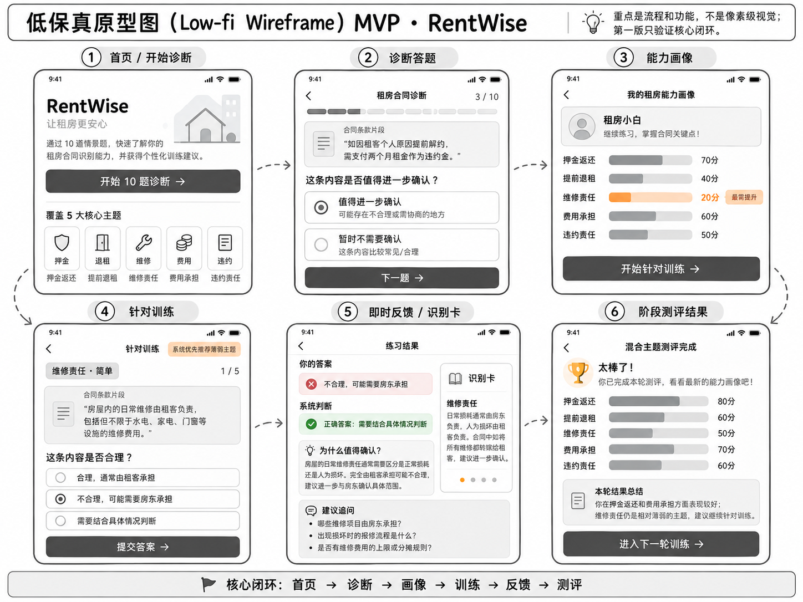
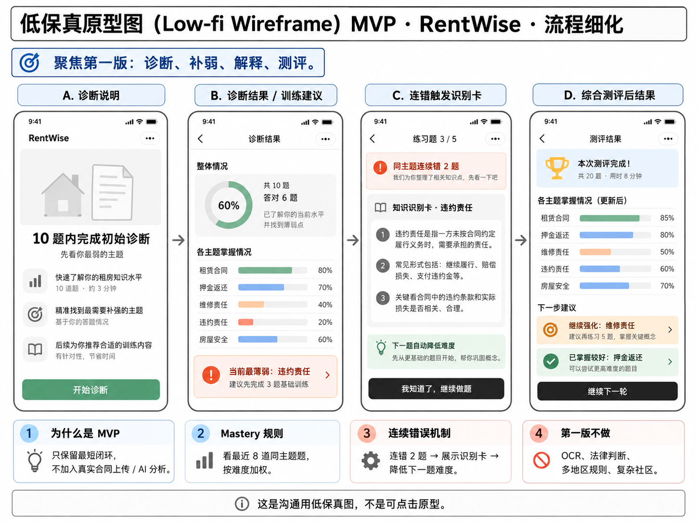

# RentWise

RentWise 是一个面向第一次独立租房用户的**租房签约条款识别训练系统**。当前仓库为课程项目的 **v0.1 模块化单体 Demo**，目标是先验证业务闭环，再逐步演进为微服务。

> RentWise 不替用户审合同，也不判断条款合法/违法。它训练用户识别“哪些内容值得继续确认”。

## v0.1 能做什么

核心闭环：

```text
初始诊断
  ↓
五类 Mastery 能力画像
  ↓
薄弱主题优先训练
  ↓
即时反馈 + 建议追问
  ↓
Mastery 更新
  ↓
阶段测评
```

五个训练主题：

- 押金返还
- 提前退租
- 维修责任
- 费用承担
- 违约责任

当前 Demo 预置 10 道诊断案例（5 个主题 × 2 道）。Mastery 使用最近最多 8 道同主题答题记录的难度加权正确率计算：EASY=1、MEDIUM=2、HARD=3。同主题连续错 2 题后，系统展示识别卡，并将下一题难度降低一级。

## 为什么先做模块化单体

代码虽然只部署为一个 Spring Boot 应用，但内部已经按未来四个微服务边界组织：

```text
user      -> 用户身份
training  -> 题目与答题事实
profile   -> Mastery 与能力画像
plan      -> 下一步训练决策
```

核心原则：**Training = 事实，Profile = 状态，Plan = 决策。**

模块之间不直接访问对方 Repository，也不跨模块传 JPA Entity。后续课程迭代会把四个模块拆为独立服务，再接入 Nacos、Sentinel、Gateway、Seata、SkyWalking 等治理组件。

## 技术栈

- Java 17
- Spring Boot 3.4.x
- Spring Web
- Spring Data JPA
- Bean Validation
- MySQL 8
- springdoc-openapi / Swagger UI
- Maven
- JUnit 5
- H2（仅测试环境）

## 本地运行

### 1. 准备环境

需要：

- JDK 17+
- Maven 3.9+
- MySQL 8

### 2. 初始化数据库

```bash
mysql -u root -p < sql/init.sql
```

默认数据库名：

```text
rentwise
```

### 3. 配置数据库

默认配置：

```text
DB_URL=jdbc:mysql://localhost:3306/rentwise?useUnicode=true&characterEncoding=UTF-8&serverTimezone=Asia/Shanghai&allowPublicKeyRetrieval=true&useSSL=false
DB_USERNAME=root
DB_PASSWORD=root
```

也可以通过环境变量覆盖：

```bash
export DB_USERNAME=root
export DB_PASSWORD=your_password
```

Windows PowerShell：

```powershell
$env:DB_USERNAME="root"
$env:DB_PASSWORD="your_password"
```

### 4. 启动

```bash
mvn spring-boot:run
```

服务默认运行在：

```text
http://localhost:8080
```

Swagger UI：

```text
http://localhost:8080/swagger-ui.html
```

## Demo 演示顺序

建议使用 `userId=1`。

### 1. 开始诊断

```http
POST /api/diagnosis/start?userId=1
```

返回 10 道模拟合同题和 `sessionId`。

### 2. 提交 10 道诊断答案

```http
POST /api/diagnosis/{sessionId}/answers
Content-Type: application/json

{
  "caseId": 1,
  "selectedClarify": true
}
```

### 3. 完成诊断

```http
POST /api/diagnosis/{sessionId}/finish
```

返回：

- 五类 Mastery
- 当前薄弱主题
- 首轮训练计划
- 下一道推荐题

### 4. 查看能力画像

```http
GET /api/profile/1
```

### 5. 获取下一道训练题

```http
GET /api/training/next?userId=1
```

### 6. 提交训练答案

```http
POST /api/training/answers
Content-Type: application/json

{
  "userId": 1,
  "caseId": 5,
  "selectedClarify": true
}
```

返回判断结果、解释、建议追问、更新后的 Mastery 和下一题。

### 7. 开始阶段测评

```http
POST /api/assessment/start?userId=1
```

### 8. 完成阶段测评

```http
POST /api/assessment/{sessionId}/finish
Content-Type: application/json

{
  "answers": [
    {"caseId": 1, "selectedClarify": true},
    {"caseId": 3, "selectedClarify": true},
    {"caseId": 5, "selectedClarify": true},
    {"caseId": 7, "selectedClarify": true},
    {"caseId": 9, "selectedClarify": true}
  ]
}
```

## 测试

```bash
mvn clean test
```

测试覆盖重点：

- 诊断题必须是 5 类 × 2 道
- 最近 8 道同主题题的难度加权 Mastery
- 少于 8 道时按已有记录计算
- 未初始化画像时返回明确错误
- 连错计数必须按连续时间序列和主题判断
- 推荐优先选择最弱主题
- 连错 2 题降低一档难度
- 避免立即重复上一道题
- 重复完成诊断不重复创建画像与计划
- 阶段测评更新 Mastery

## 产品设计图

### 用户故事地图



### MVP 低保真原型





## 文档

- [架构说明](docs/architecture.md)
- [MVP 范围](docs/mvp.md)
- [API 说明](docs/api.md)
- [设计说明](docs/superpowers/specs/2026-10-08-rentwise-mvp-design.md)
- [实现计划](docs/superpowers/plans/2026-10-08-rentwise-mvp-demo-implementation.md)

## 后续课程演进

v0.1 **尚未**接入以下组件：

- Nacos
- Sentinel
- Gateway
- Seata
- SkyWalking
- Redis
- RocketMQ

计划后续按课程进度逐步接入，而不是为了展示组件提前污染核心业务。

每引入一个新工具，都回答三个问题：

1. 它解决什么问题？
2. RentWise 哪个真实场景需要它？
3. 如果没有真实场景，怎样以最小成本满足课程要求而不污染业务？

## 项目状态

当前：`v0.1 modular-monolith demo`

下一阶段：拆分 `user-service / training-service / profile-service / plan-service`，首先接入 Nacos 服务注册。
